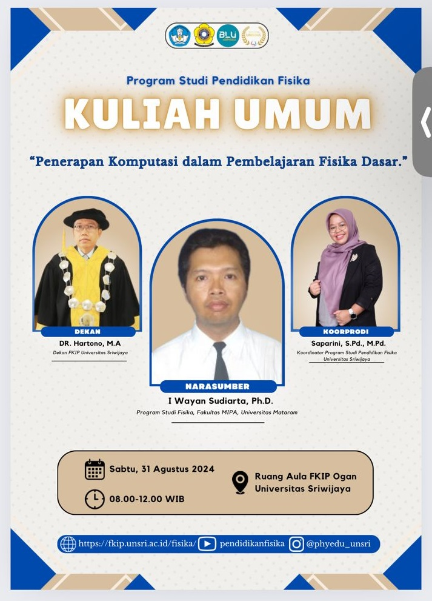

# komputasi-fisika-dasar
Penerapan Komputasi untuk MK Fisika Dasar menggunakan Aplikasi Excel dan Python

Repositori ini menyediakan kumpulan materi untuk **Kuliah Umum tentang penerapan Komputasi pada MK Fisika Dasar** yang diadakan oleh Program Studi Pendidikan Fisika, FKIP, Universitas Sriwijaya. Tentunya ada materi yang belum semua sempurna/komplit karena keterbatasan waktu untuk merevisinya. Jika ada ditemukan kesalahan ataupun ada saran perbaikan, diharapkan menginformasikan ke Pak I Wayan Sudiarta (wayan.sudiarta at unram.ac.id). Semoga materi ini bermanfaat. Salam Komputasi! 

Tautan Penting:
1. Penulisan dengan format Markdown di Jupyter Notebook atau Google Colab: <https://www.markdownguide.org/basic-syntax/>
2. Belajar penulisan rumus/persamaan dengan LaTeX: <https://tobi.oetiker.ch/lshort/lshort.pdf>

